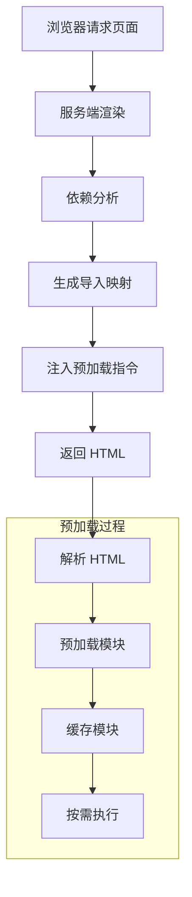

# 模块链接

## 概述

Gez 框架提供了一套完整的模块链接机制，用于管理服务间的代码共享和依赖关系。本文档详细说明如何在 Gez 框架中实现模块的导出、导入和依赖管理。

## 核心概念

### 模块导出
模块导出是将服务中的特定代码单元（如组件、工具函数等）以 ESM 格式对外暴露，使其可被其他服务引用。

### 模块导入
模块导入是在服务中引用其他服务导出的代码单元的过程，支持多种安装方式以满足不同场景需求。

## 预加载机制

### 工作原理



### 关键步骤说明

1. **依赖分析**
   - 服务端分析组件依赖关系
   - 识别关键路径模块
   - 确定模块加载优先级

2. **预加载策略**
   - 立即加载：关键路径模块
   - 延迟加载：非关键模块
   - 按需加载：条件性模块

3. **资源优化**
   - 模块打包优化
   - 代码分割策略
   - 缓存管理机制

## 配置指南

### 导出配置

在 `entry.node.ts` 中配置需要导出的模块：

```ts
import type { GezOptions } from '@gez/core';

export default {
    modules: {
        exports: [
            // 导出源码文件
            'root:src/components/button.vue',
            'root:src/utils/format.ts',
            // 导出第三方依赖
            'npm:vue',
            'npm:vue-router'
        ]
    }
} satisfies GezOptions;
```

### 安装方式

#### 源码安装
源码安装方式需要执行构建，导入时需要指向构建产物目录（dist）。这种方式适合开发环境，支持实时修改和热更新。

##### 1. Workspace 方式
推荐在 Monorepo 项目中使用：

```json
{
    "devDependencies": {
        "ssr-remote": "workspace:*"
    }
}
```

**优势**：
- 支持多包协同开发
- 依赖版本统一管理
- 便于调试和代码共享

##### 2. Link 方式
用于本地开发调试：

```json
{
    "devDependencies": {
        "ssr-remote": "link:../ssr-remote/dist"
    }
}
```

**优势**：
- 直接从源码构建
- 便于本地开发调试
- 支持实时修改和热更新

**局限性**：
- 需要手动管理依赖关系
- 仅适用于本地开发环境

#### 软件包安装

软件包安装方式直接使用构建后的产物，适合生产环境使用。

##### 1. NPM Registry
通过 npm registry 安装已发布的软件包：

```json
{
    "dependencies": {
        "ssr-remote": "^1.0.0"
    }
}
```

**优势**：
- 安装速度快
- 版本管理规范
- 适合生产环境

##### 2. 静态服务器
将构建产物部署到静态服务器，支持 HTTP 或 HTTPS 协议：

```json
{
    "dependencies": {
        "ssr-remote": "https://cdn.example.com/ssr-remote/1.0.0.tgz"
    }
}
```

**优势**：
- 完全控制分发流程
- 支持私有部署
- 适合特殊网络环境

## 构建软件包

### 配置说明

在 `entry.node.ts` 中配置：

```typescript
import type { GezOptions } from '@gez/core';

export default {
    // 模块导出配置
    modules: {
        exports: [
            'root:src/components/button.vue',
            'root:src/utils/format.ts',
            'npm:vue'
        ]
    },
    // 打包配置
    pack: {
        // 启用打包功能
        enable: true,

        // 支持多版本输出
        outputs: [
            'dist/client/versions/latest.tgz',
            'dist/client/versions/1.0.0.tgz'
        ],

        // 自定义 package.json
        packageJson: async (gez, pkg) => {
            pkg.version = '1.0.0';
            return pkg;
        },

        // 打包前钩子：添加文档、执行类型检查等
        onBefore: async (gez, pkg) => {
            // 例如：生成类型声明
            // 执行测试用例
            // 更新文档等
        },

        // 打包后钩子：部署、发布等
        onAfter: async (gez, pkg, file) => {
            // 例如：上传到 CDN
            // 发布到 npm 仓库
            // 部署到测试环境等
        }
    }
} satisfies GezOptions;
```

### 构建命令

```bash
# 开发环境启动（支持热更新）
gez dev

# 生产环境构建
npm run build           # 执行完整构建
npm run build:ssr       # 仅构建 SSR
npm run build:dts       # 仅生成类型声明

# 预览生产环境
gez preview

# 启动生产服务器
NODE_ENV=production node dist/index.js
```

### 构建产物

```
your-app-name.tgz
├── package.json         # 包信息
├── index.js             # 生产环境的 Node.js 服务器入口
├── server/              # 服务端渲染相关
│   └── manifest.json    # 服务端资源映射文件
├── node/                # Node.js 服务器运行时代码
└── client/              # 客户端资源
    └── manifest.json    # 客户端资源映射文件
```

### 发布流程

```bash
# 1. 构建生产版本
gez build

# 2. 发布到 npm
npm publish dist/versions/your-app-name.tgz
```

## 最佳实践

1. **开发环境**
   - 使用 Workspace 或 Link 方式
   - 启用热更新
   - 保持依赖版本一致

2. **生产环境**
   - 使用 NPM Registry 或静态服务器
   - 锁定依赖版本
   - 确保构建产物的完整性

3. **版本管理**
   - 遵循语义化版本
   - 及时更新依赖
   - 做好版本兼容性测试